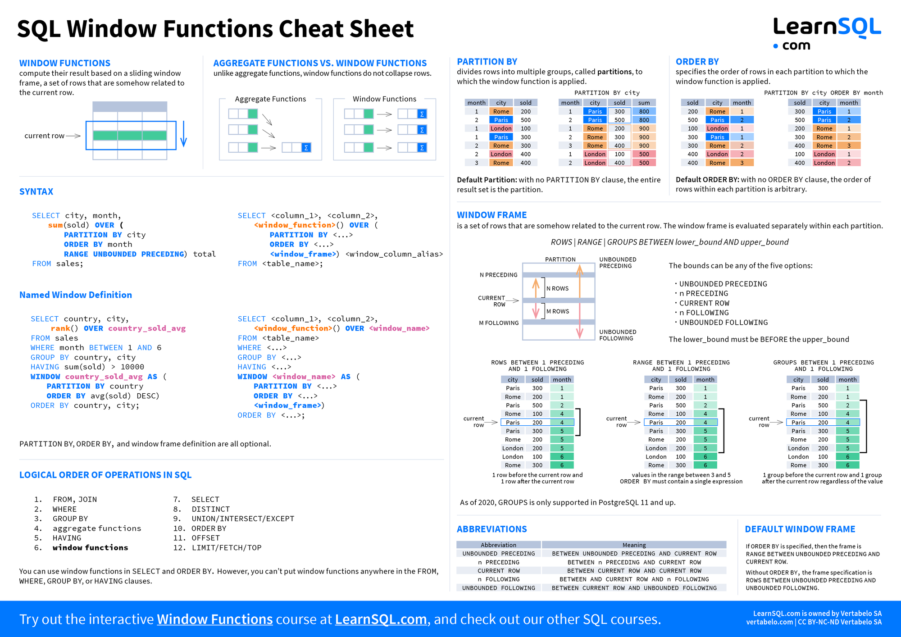

# Analytic Functions

## Keywords

1. Analytic Functions(Window Functions)
   * `OVER`, `PARTITION BY`, `ORDER BY`
   * Window Frame
   * Tres tipos
      * `Aggregate Functions`
      * `Navigation Functions`
      * `Numbering Functions`
   * Ejemplos
2. Ejericios
   * Predicción de demanda de taxis
   * Separar y ordenar viajes por área de la comunidad
   * Tiempo entre viajes

## Notes

1. **Analytic Functions**: nos permiten hacer calculos complejos. Devuelven un valor por cada fila en la tabla.
   * Todas las funciones analíticas tienen una cláusula `OVER` que define el conjunto de filas sobre el que se realiza el cálculo.
   * `PARTITION BY`: divide el conjunto de filas en particiones a las que se aplica la función analítica.
     * Si no se especifica, se aplica a todas las filas.
   * `ORDER BY`: especifica el orden de las filas en cada partición que hace `PARTITION BY`.
   * **Window Frame**: Indentifica el conjuntos de filas utilizado para cada calculo.
      * Tiene un aspecto largo: `ROWS BETWEEN 1 PRECEDING AND 1 CURRENT ROW`.
      * Cada grupo o conjunto de filas se llama `Window`.
      * Se combina con la clausula `OVER` para definir el conjunto de filas sobre el que se realiza el cálculo.
      * Algunos ejemplos de clausulas vienen en el jupyter notebook de la clase [aquí](analytic-functions.ipynb) o en Referencias.
   * Tres tipos de funciones analíticas(se usan despues de `OVER`):
      * `Analytic Aggregate Functions`: son funciones de agregación que devuelven un solo valor por cada grupo de filas. Son: `AVG()`, `SUM()`, `COUNT()`, `MIN()`, `MAX()`.
      * `Analytic Navigation Functions`: asigan valores a una fila basado en otra fila relativa. Son: `LEAD()`, `LAG()`, `FIRST_VALUE()`, `LAST_VALUE()`.
      * `Analytic Numbering Functions`: Asigna un enum dependiendo del orden de las filas. Son: `ROW_NUMBER()`, `RANK()`, `DENSE_RANK()`, `NTILE()`.

## Exercises

### 1) How can you predict the demand for taxis?

Hay que sacar el promedio de viajes entre dos fechas.

* Llenas los campos para hacer uso de las funciones analíticas.
* Tenemos lista las dos columnas: date y num_trips.
* Si en la función `WITH` ya está ordenado por el `GROUP BY` requerido, no repetir en el `OVER`.

### 2) Can you separate and order trips by community area?

La tabla tiene las columnas: `pickup_community_area`, `trip_start_timestamp`, `trip_end_timestamp`.
Tengo que añadir una llamada `trip_number` que muestre el orden en el que los viajes se realizaron en cada área de la comunidad.

* Para este ejercicio se puede utilizar el enumerador `RANK()`.
* Para cada diferente `pickup_community_area` se debe ordenar por `trip_start_timestamp`.

### 3) How much time elapses between trips?

Editar una query para añadir una columna `prev_break` que muestra el break que tuvo un taxi antes de empezar el viaje actual en minutos.

* Se hacen las particiones por `taxi_id`, y se ordenan por el tiempo que empieza el viaje. Esto para que el tiempo de terminada de viaje anterior este antes de que empiece el viaje actual.
* Como se necesita la fila anterior para calcular con la fila actual se usa la función `LAG(trip_end_timestamp)`.

## Aprendizajes

* `ROWS BETWEEN UNBOUNDED PRECEDING AND CURRENT ROW` es el valor por defecto.
* Las funciones analíticas nos sirve para hacer cálculo más enfocados en conjuntos de filas de tengan algo en común.

### Exercise 2

* Algunas funciones analíticas van sin argumentos, otras llevan argumentos. **CUIDADO CON ESTO**

### Exercise 3

* Se puede usar `OVER` dentro de otras funciones analíticas como `TIMESTAMP_DIFF()`. Porque de vuelve una columna por cada fila.

## Referencias

* Documentación de Google Cloud sobre las funciones analíticas y Window Frame:
[https://cloud.google.com/bigquery/docs/reference/standard-sql/window-function-calls](https://cloud.google.com/bigquery/docs/reference/standard-sql/window-function-calls)

* Cheat Sheet de Window Functions:
[https://learnsql.com/blog/sql-window-functions-cheat-sheet/](https://learnsql.com/blog/sql-window-functions-cheat-sheet/)

